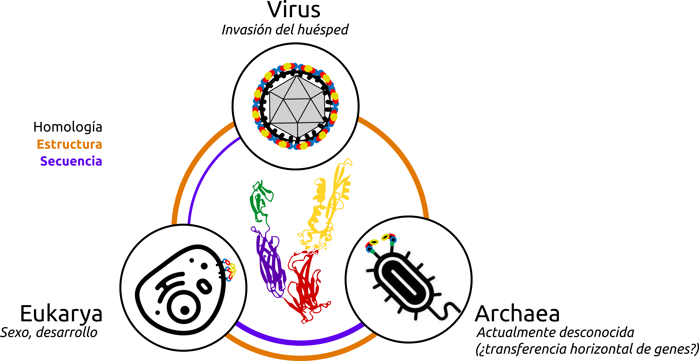

# ¿Qué son las _Fusexinas_?

Si usted no es un clon, su vida como individuo físico comenzó con la fusión de dos células. 
La fusión de membranas es un proceso central en biología: genera nuevos individuos fusionando gametos, construye epitelios multinucleados tales como músculo y placenta. 
También posibilita el transporte intracelular, la entrada a la célula de virus
envueltos y muchas variantes de estos fenómenos. Durante la evolución, la fusión de
membranas habilitó la formación de la célula eucariota, la adquisición de mitocondrias
y cloroplastos. Notablemente, con más de 100 años de estudio, la maquinaria que
fusiona al espermatozoide y óvulo en vertebrados sigue sin conocerse.La fusión de
membranas es termodinámicamente desfavorable y requiere una maquinaria ad hoc.
Numerosas proteínas que habilitan la fusión, llamadas fusógenos han sido descritas y
clasificadas. Hemos anteriormente predicho y validado experimentalmente un
fusógeno eucariota responsable de la fusión de gametos.Encontramos que este
fusógeno es homólogo a los fusógenos de clase II de virus envueltos revelando un
antiguo intercambio entre virus y eucariotas, con importantes consecuencias para el 
origen del sexo, punto de inflexión en la evolución de la complejidad celular. Nuestros
resultados hoy muestran que estos fusógenos existen en Arquea, enriqueciendo el
panorama.En este proyecto nos proponemos comprender estos intercambios en los
albores de la vida celular, integrando minería de datos con herramientas de
bioinformática estructural y genómica computacional. A un tiempo, describiremos la
historia evolutiva de los fusógenos y las fuerzas que moldean la misma, e
identificaremos nuevos candidatos a ser validados experimentalmente.

{width="90%"}

# Algunos trabajos de relevancia
- HAP2/GCS1 2017 + Fedry + etc... (como un extra)
- Moi et al 2022
- The EVE
- The egg or the virus

# _Fusexinas_ en la prensa
- [_A billion years before sex, ancient cells were equipped for it_](https://www.quantamagazine.org/ancient-cells-had-sex-fusion-proteins-long-before-sex-evolved-20220216/). Una nota de la revista ***Quanta magazine*** en la que...
- ladiaria
- Entrevista a David y Pablo
- Entrevista Karolinska
- Entrevista Haifa

# ¿Te interesa el tema? ¡Colaborá con nosotros y sumate a estudiar a las _Fusexinas_!
...
