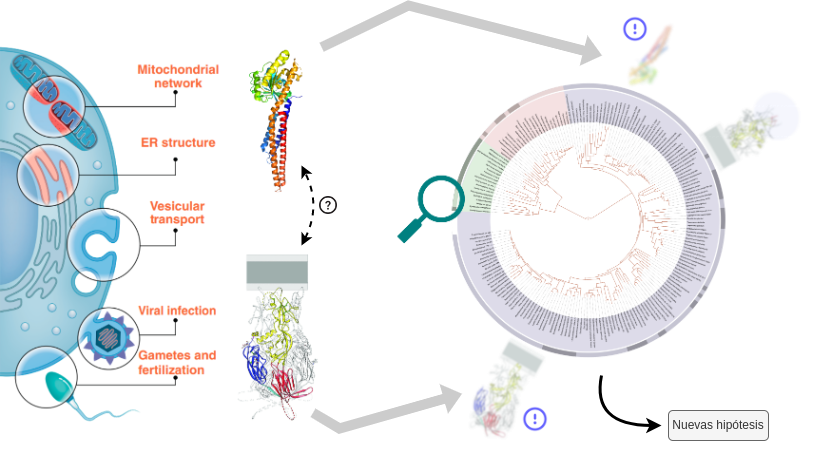

# Fusión de membranas: un proceso fundamental

La vida tal como la conocemos depende en gran medida de membranas celulares. La existencia misma de células requiere por definición de la compartimentalización que brindan estas membranas. La aparición y evolución de distintos tipos celulares que tuvo lugar desde la aparición de las primeras células (estimado hace … millones de años) hasta la actualidad tiene en gran parte su base en la dinámica de interacción y fusión que adquirieron estas células y los distintos compartimentos que se encuentran delimitados dentro de ellas. Una variedad de fenómenos clave dependen de la fusión de membranas, como por ejemplo el transporte intra y extracelular (permitiendo la adquisición y expulsión de nutrientes, o la comunicación celular), la formación del tejido muscular o la invasión de células por parte de virus envueltos. Sin ir más lejos el sexo. una característica eucariota definitoria, tiene su base en la fusión de gametos.

Estos eventos están lejos de ser completamente azarosos y espontáneos: proteínas denominadas **fusógenos** son parte de la maquinaria celular *ad hoc* que cataliza estas fusiones termodinámicamente desfavorables. La especificidad que brindan estos fusógenos celulares es la base para la organización del incesante, y a primera vista caótico, baile de membranas que subyace a la vida.

# Búsqueda de fusógenos por métodos computacionales

{width="80%"}

Estudios recientes de nuestro grupo de trabajo y colaboradores permitieron predecir y validar experimentalmente un fusógeno eucariota responsable de la fusión de gametos. Encontramos que este fusógeno es homólogo a los fusógenos de clase II de virus envueltos revelando un antiguo intercambio entre virus y eucariotas.

{width="90%"}

Este hallazgo tiene importantes consecuencias para la formulación de preguntas evolutivas relativas al origen del sexo, un punto de inflexión en la evolución de la complejidad celular. Lo que es más, nuestros resultados hoy muestran que estos fusógenos existen en Archaea, enriqueciendo el panorama. ¿Fue el sexo una invención arqueana, viral o eucariota? ¿Qué función cumplen las fusexinas arqueanas?. Estas son preguntas que no tienen una respuesta clara a la fecha.

El panorama es aún más enigmático en otros casos. A modo de ejemplo, se desconocen fusógenos sexuales en hongos o vertebrados. Otros fusógenos celulares descritos en la literatura también carecen de un estudio exhaustivo tanto en lo referente a su distribución como a su dinámica evolutiva, lo cual es indispensable para poder comprender la evolución de algunos de los procesos biológicos antes nombrados. 

La aparición de nuevas herramientas para la inferencia de modelos estructurales como AlphaFold2 resulta en este sentido revolucionaria, en tanto permiten la detección de homólogos remotos a partir del alineamiento de modelos estructurales. 

# Pasantía de grado en el estudio de fusógenos celulares

La persona interesada en realizar su pasantía en esta línea podrá definir uno o más fusógenos de interés para estudiar su distribución taxonómica y dinámica evolutiva. Se utilizarán herramientas vinculados a la inferencia y análisis filogenético a través del análisis de secuencia y, eventualmente, información de modelos estructurales.

Durante el desarrollo de la pasantía de grado la persona aprenderá:

- Utilización de la línea de comandos en entorno Linux.
- Manejo de datos reproducibles (*e.g.* programación en notebooks, manejo de repositorios GitHub).
- Programación básica y utilización de programas en los lenguajes bash, Python y/o R.

Es de esperar que las herramientas adquiridas en biología computacional y análisis de datos biológicos desde una perspectiva evolutiva sirvan a él/la estudiante en el mediano y largo plazo sin importar el área en la cual elija desarrollarse a futuro.

___
**Si te interesa realizar tu pasantía de grado en este tema nos podés contactar a: mgrana@pasteur.edu.uy, eletor@fcien.edu.uy o mlangleib@pasteur.edu.uy**.
___

# Algunos trabajos de relevancia
- [***Arabidopsis* HAP2/GCS1 is a gamete fusion protein homologous to somatic and viral fusogens**](https://www.ncbi.nlm.nih.gov/pmc/articles/PMC5350521/pdf/JCB_201610093.pdf) 
- [The ancient gamete fusogen HAP2 is a eukaryotic class II fusion protein](https://www.cell.com/action/showPdf?pii=S0092-8674%2817%2930109-5)
- [Structure-function studies link class II virus fusogens with the ancestral gamete fusion protein HAP2](https://www.cell.com/action/showPdf?pii=S0960-9822%2817%2930084-2)
- [What came first, the virus or the egg?](https://www.cell.com/cell/pdf/S0092-8674(17)30190-3.pdf)
- [HAP2/GCS1: Mounting evidence of our true biological EVE?](https://journals.plos.org/plosbiology/article/file?id=10.1371/journal.pbio.3000007&type=printable)
- [**Discovery of archaeal fusexins homologous to eukaryotic HAP2/GCS1 gamete fusion proteins**](https://www.nature.com/articles/s41467-022-31564-1)

> **Nota**: los artículos marcados en negrita fueron publicados por nuestro grupo de investigación en colaboración con otros laboratorios de Argentina, Suiza, Suecia e Israel.

# _Fusexinas_ en la prensa
- [_A billion years before sex, ancient cells were equipped for it_](https://www.quantamagazine.org/ancient-cells-had-sex-fusion-proteins-long-before-sex-evolved-20220216/). Una nota de la revista ***Quanta magazine*** en la que...
- [_Si te gusta el sexo, tal vez tendrías que darles las gracias a las arqueas_](https://ladiaria.com.uy/ciencia/articulo/2022/7/si-te-gusta-el-sexo-tal-vez-tendrias-que-darles-las-gracias-a-las-arqueas/).
- [_Científicos del CONICET lideran estudio que arroja luz sobre el origen de la reproducción sexual_](https://www.conicet.gov.ar/cientificos-del-conicet-lideran-estudio-que-arroja-luz-sobre-el-origen-de-la-reproduccion-sexual/).
- [_A molecule from ancient bacteria-like cells may shed new light on sexual reproduction_](https://news.ki.se/a-molecule-from-ancient-bacteria-like-cells-may-shed-new-light-on-sexual-reproduction).
- [_Technion researchers and international colleagues hypothesize that the cellular mechanisms enabling the fusion of sperm cells and egg cells originated 3 billion years ago_](https://www.technion.ac.il/en/2022/07/primordial-sexual-reproduction/).

