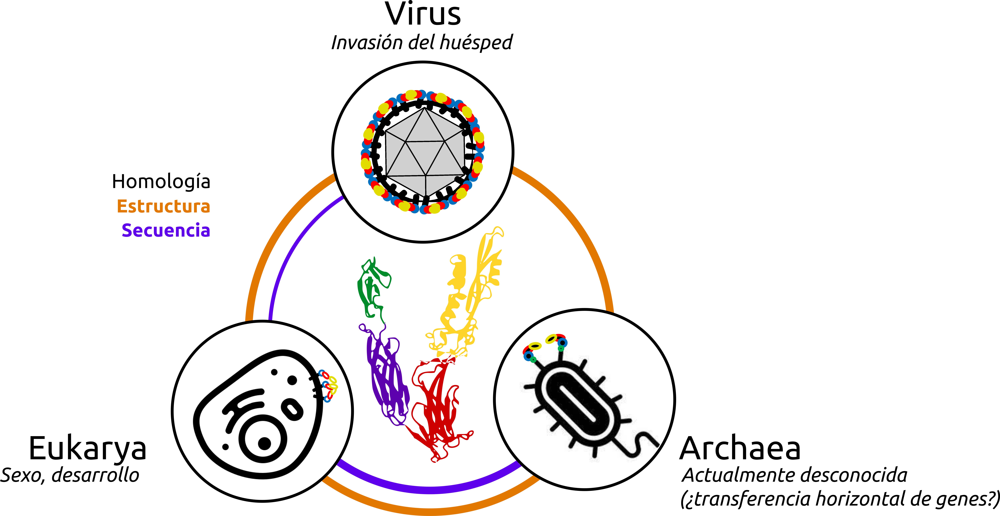

# ¿Qué son las _Fusexinas_?

> parrafo inicial

{width="80%"}

# Algunos trabajos de relevancia
- HAP2/GCS1 2017 + Fedry + etc... (como un extra)
- Moi et al 2022
- The EVE
- The egg or the virus

# _Fusexinas_ en la prensa
- [_A billion years before sex, ancient cells were equipped for it_](https://www.quantamagazine.org/ancient-cells-had-sex-fusion-proteins-long-before-sex-evolved-20220216/). Una nota de la revista ***Quanta magazine*** en la que...
- ladiaria
- Entrevista a David y Pablo
- Entrevista Karolinska
- Entrevista Haifa

# ¿Te interesa el tema? ¡Colaborá con nosotros y sumate a estudiar a las _Fusexinas_!
...
